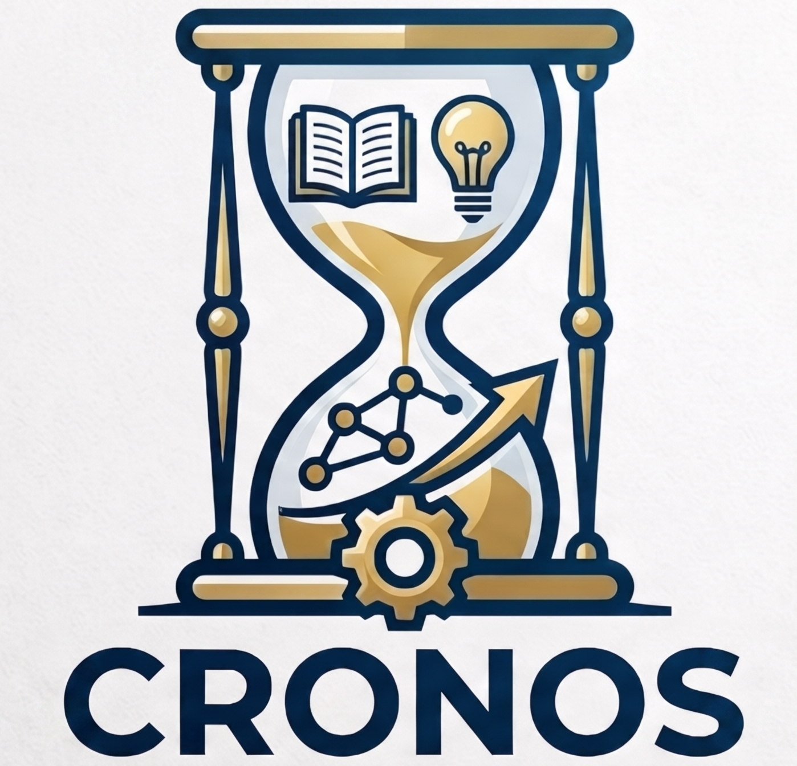

<table border="0" cellpadding="0" cellspacing="0">
<tr>
<td width="70%" valign="middle">

<h1>CRONOS</h1>

<b>Convex Neural Networks via Operator Splitting</b><br>
A scalable JAX framework for global optimization of two-layer neural networks via convex reformulation and operator splitting (ADMM).

<p>
  <a href="https://arxiv.org/abs/2411.01088"></a>
  
  
  
</p>

</td>
<td width="30%" valign="middle" align="right">

</td>
</tr>
</table>

---

Welcome to the official implementation for the **CRONOS project**! Check out the [paper](https://arxiv.org/abs/2411.01088) for more details.

## Overview

We introduce the **CRONOS** algorithm for convex optimization of two-layer neural networks. This repo contains the official JAX implementation of the CRONOS paper, and allows installation as a handy pip package for all your binary classification needs.

## CRONOS and CRONOS-AM

- **CRONOS**: Uses convex optimization to train two-layer neural networks efficiently at scale. Experiments include fullsize ImageNet, downsampled ImageNet, IMDb, Food, FMNIST, CIFAR-10, MNIST, and synthetic datasets.
- **CRONOS-AM**: CRONOS with Alternating Minimization. This extension allows training of multi-layer networks with arbitrary architectures (MLP, CNN, GPT, etc.).

## Key Features

- **Scalability**: CRONOS can handle high-dimensional datasets.
- **Convergence**: Our theoretical analysis demonstrates that CRONOS converges to the global minimum of the convex reformulation under mild assumptions.
- **Performance**: Large-scale numerical experiments with GPU acceleration in JAX. Optimized to be VRAM friendly without sacrificing speed. 

## Results

---

## Installation

Clone the repository and install from source:

```bash
git clone https://github.com/pilancilab/CRONOS.git
cd CRONOS
pip install -e .
```
---

## Citation

If you use this code in your work, please cite the paper:

```bibtex
@inproceedings{feng2024cronos,
  title     = {CRONOS: Convex Neural Networks via Operator Splitting},
  author    = {Feng, Miria and Frangella, Zachary and Pilanci, Mert},
  booktitle = {Advances in Neural Information Processing Systems (NeurIPS)},
  year      = {2024},
  url       = {https://arxiv.org/abs/2411.01088}
}
```
---

# TODO: 
- add in jupyter demo
- hydra + omegaconf (user sets dataset, add new dataset, template loader)
- add in instructions for vision and GPT2, especially GPT2 (3 step run process)
- RTX4090 minimum, JAX, NVIDIA, CUDA, NVIDIA driver versions
- add in sharding here, or in separate codebase? 
- consolidate 3 step run process for gpt, consolidate 2 runners
- populate tests for all modules
- populate requirements.txt
- push to PyPI
